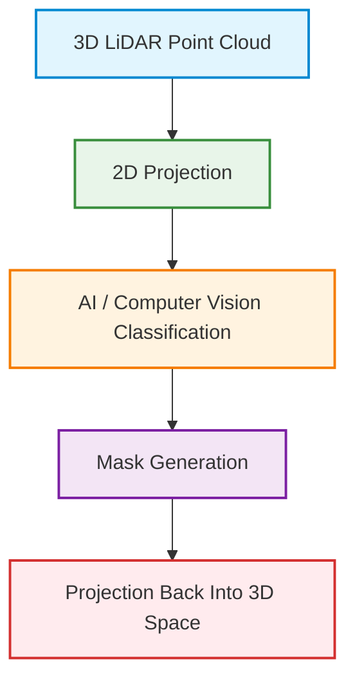

## Core Project Focus

The project is centered around the following domains:
*  **LiDAR Point Cloud Understanding** — Ingesting, parsing, and representing 3D spatial data.
*  **Projection-Based Classification** — Simplifying 3D scene understanding via 2D projections.
*  **AI-Assisted Scene Segmentation** — Leveraging mature 2D computer vision models to identify entities.
*  **Civil Engineering Applications** — Tailoring classification for infrastructure and large-scale terrains.
*  **Large-Scale Spatial Data Processing** — Architecting memory-safe, efficient pipelines for massive datasets.

---

##  High-Level Project Goal

The primary objective is to build a processing pipeline capable of:
1. **Loading** large-scale LiDAR point clouds.
2. **Generating** 2D projections from 3D spatial data.
3. **Running** AI / computer vision classification on the 2D projections.
4. **Mapping** the classified regions back into the original 3D space.

> [!NOTE]
> The initial phase must prioritize establishing a **proof-of-concept**, developing a **minimum working example**, and verifying **practical feasibility** before optimizing or scaling the system.

---

## Main Conceptual Pipeline

The diagram below outlines the core pipeline for the project:



*This linear pipeline represents the central idea behind the project.*

---

## Projection-Based Classification

Rather than training native 3D neural networks (which are computationally heavy and highly complex), the project utilizes a projection-based classification strategy.

### Why Use 2D Projections?
* **Simpler Implementation:** Leverages standard image coordinate grids rather than sparse 3D spatial grids.
* **Robust Initial Strategy:** High reliability with lower initial engineering overhead.
* **Easier Debugging:** Highly visual; problems in the pipeline can be spotted quickly on 2D images.
* **No Direct 3D Model Training:** Avoids the need to train complex 3D architectures (e.g., PointNet, PointCNN).
* **Ecosystem Reuse:** Enables immediate integration of highly mature 2D computer vision models.

### The 3D Alternative (Future/Advanced)
Directly processing 3D data would require:
* Heavy 3D neural network training.
* Significantly more infrastructure and GPU resources.
* Much higher implementation complexity.

---

##  Important Design Philosophy

### Do Not Reinvent the Wheel
* **Existing Libraries:** Use packages like `laspy` and `Open3D` rather than writing parsers or renderers from scratch.
* **Existing Viewers:** Rely on tools like `Potree` or `CloudCompare` for visualization.
* **Existing AI Models:** Use pre-trained detectors (like `YOLO` or `Segment Anything`) to segment the 2D projections.
* **Reuse Infrastructure:** Optimize and run on existing hardware configuration rather than building custom clusters.

> [!IMPORTANT]
> The ultimate goal is **intelligent integration** of existing tools, not rebuilding the spatial computing ecosystem from scratch.

---

##  Minimum Working Example (MWE)

The first development milestone must focus entirely on producing a functional MWE.

### MWE Capabilities
- [ ] **Load Point Cloud:** Ingest LiDAR files (`.las`) without crashing the environment.
- [ ] **Generate 2D Projection:** Output clean orthographic depth or intensity images.
- [ ] **Detect Simple Objects:** Correctly classify major structures (e.g., roads, buildings).
- [ ] **Project Back to 3D:** Map 2D classification masks back onto the corresponding 3D points.
- [ ] **Demonstrate Functionality:** Verify the flow with a simple, execution-ready Python script.

> [!TIP]
> A simple Python script is acceptable initially. The first implementation does **NOT** require a web interface, a polished UI, production deployment, or distributed computing infrastructure.

---

##  LiDAR Point Clouds

### Core Structure
Point clouds are essentially massive spatial tables representing unstructured 3D datasets.
```text
[ X, Y, Z, R, G, B ]
```
Each point in the cloud consists of:
* **Spatial Coordinates:** ($X, Y, Z$) representing the exact position in space.
* **Optional Color Information:** ($R, G, B$) or intensity/reflectivity values.

### Why Point Clouds are Difficult
* **Humans** easily recognize semantic structures (roads, buildings, terrain) in visual space.
* **Computers** only see a sea of disconnected spatial coordinates.
* Consequently, **segmentation**, **classification**, and **object extraction** are significantly harder to compute natively in 3D.

---

##  Projection & Camera Geometry

### Orthographic Projection
The professor recommends using **Orthographic Projection** rather than perspective rendering or complex camera models.
* **Advantages:**
  * Simpler geometry and linear math.
  * Direct, predictable reprojection mapping.
  * Absence of perspective distortion (objects do not shrink with distance).
  * Easier troubleshooting and geometric validation.

### Camera Representation
A camera view can be defined using:
1. **$X, Y, Z$ position** (translation vector).
2. **3 rotational angles** (roll, pitch, yaw rotation matrix).

Together, these parameters define the **viewpoint**, **orientation**, and **projection geometry**.

> [!WARNING]
> ### The Geometric Challenge: 2D ⇄ 3D Mapping
> The pipeline depends heavily on an invertible geometric workflow:
> 1. Project $3D \rightarrow 2D$.
> 2. Run classification to get a 2D mask.
> 3. Trace back pixels to determine exactly which 3D points generated them.
> 
> The professor emphasized that implementing precise **transformation matrices** and **forward/backward mapping** logic is one of the core research problems.

---

##  AI / Computer Vision Discussion

The project is exploring various avenues for semantic classification:
* **YOLO** (You Only Look Once) for object detection.
* **OpenCV** for traditional image processing/thresholding.
* **Local LLMs** / Multimodal models (e.g., Llama-3-Vision).

### Why Use Local Models?
* **Offline Deployment:** Independence from internet connections and cloud services.
* **No API Dependencies:** Zero cost, no API key management, and no rate limit issues.
* **Lower Operational Complexity:** Self-contained workflows that are easy to distribute.
* **Better Integration:** Directly connects with local Python visualization libraries.
* **More Control:** Allows for easy experimentation, fine-tuning, and offline analysis.

### LLM-Based Interaction Idea
One proposed direction is to treat the system like a **LiDAR Assistant**. Instead of hardcoding classification pipelines, a multimodal LLM could interpret semantic user requests:
* *"Find roads"*
* *"Detect buildings"*
* *"Locate pavements"*

---

##  Classification Hierarchy

Classification tasks should be structured hierarchically to manage complexity:

| Classification Level | Target Objects / Features | Recommended Strategy |
| :--- | :--- | :--- |
| **Coarse Level** | Roads, Buildings, Trees, Pavements | **Start here** (Primary focus) |
| **Fine Level** | Windows, Poles, Curbs, Parking spaces | Future expansion |

### Civil Engineering Focus
Civil engineering applications generally prefer **coarse segmentation** and large-scale feature extraction over tiny object-level classification.

---

##  Recommended Development Sequence


### 1. Load Point Clouds
* Ingest and parse `.las` structures.
* Extract XYZ coordinates and RGB/intensity values.
* Handle initial file size assessments.

### 2. Visualize Data
* Render data using Open3D, CloudCompare, or Potree.
* Evaluate spatial geometry, point density, and spatial scale.

### 3. Generate 2D Projections
* Create orthographic images, panoramic views, or camera projections.
* **This is considered the first major technical milestone.**

### 4. AI Classification
* Apply object detection, semantic segmentation, or custom classifications on the generated 2D images.

### 5. Reprojection
* Map classified pixels back to original 3D coordinates.
* Output labeled/color-coded point clouds.

---

## Suggested Technologies

| Tool / Library | Role in Pipeline | Primary Benefit |
| :--- | :--- | :--- |
| **Open3D** | 3D Visualization & Geometry | Native support for point clouds and visual rendering |
| **PDAL** | Data Pipeline & File I/O | Robust translation, filtering, and conversion of large datasets |
| **Potree** | Web-Based Visualization | Smooth rendering of huge datasets inside web browsers |
| **CloudCompare** | Desktop Visualization & QA | Fast desktop client for manual validation and inspections |
| **OpenCV** | 2D Image Processing | Advanced image transformations and projection calculations |
| **YOLO** | Object Detection / Segment | Real-time classification speeds on 2D images |
| **Llama (Multimodal)** | Semantic Interpretation | Natural language understanding of visual projection views |

---

## Data & Infrastructure Notes

### Data Handling & Memory Safety
LiDAR datasets are extremely large (e.g. the active campus dataset is **~16 GB** with **~411 million points**).
* **Typical Issues:** RAM exhaustion, viewer crashes, and severe storage latency.
* **Mitigation Strategies:**
  * Use **chunked loading** (e.g. using `laspy`'s `chunk_iterator`).
  * Implement spatial **downsampling** (voxel grid filters) early in the pipeline.
  * Run **selective processing** focusing only on specific Regions of Interest (ROI).

### GPU & Infrastructure Requirements
* **Workstations:** Processing massive datasets benefits from high-RAM CPU nodes, dedicated GPU nodes, and AI workstations.
* **Mac Studio (Apple Silicon):**
  * The **Unified Memory Architecture** is exceptionally fast for handling memory-intensive LiDAR arrays.
  * Simulation workloads and Julia-based pipelines see significant performance gains.
  * *Caveat:* Many specialized engineering and VR tools remain Windows-only, making hybrid configurations (Windows + Mac) necessary long-term.

---


## Final Summary

The project aims to create a practical, lightweight LiDAR classification workflow by:
1. Converting **3D Point Clouds** to **2D Projections**.
2. Performing **AI-assisted segmentation** on the 2D projections.
3. Performing **geometric reprojection** back to 3D space.

This approach minimizes complexity, maximizes tool reuse, and provides a scalable proof-of-concept. **The immediate goal is not perfection, but understanding, experimentation, and building a functional prototype.**